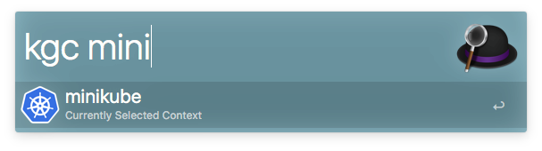
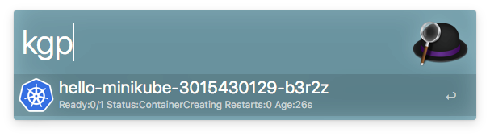
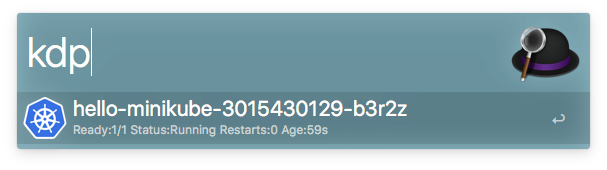
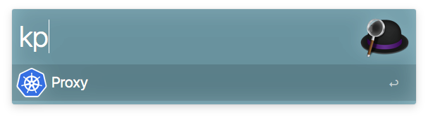

#alfred-k8s

An Alfred Workflow for Kubernetes

##Prerequisites

- [Alfred 3.x](https://www.alfredapp.com/) (this workflow is tested on 3.3.1)
- Kubernetes CLI ([kubectl](https://kubernetes.io/docs/user-guide/prereqs/)) installed at /usr/local/bin/kubectl

## Supported Commands

**kgc**: Kubernetes Get Contexts. Lists all available contexts. Enter to switch to that context.

**kgp**: Kubernetes Get Pods. Lists all pods. If running, press enter to open up terminal/bash to that pod.

**kdp**: Kubernetes Delete Pod. Delete a pod.

**kp**: Kubernetes Proxy. Open up a new proxy session and Kubernetes Dashboard.

## Installing

- Download the [Kubernetes.alfredworkflow](https://github.com/simonguest/alfred-k8s/raw/master/Kubernetes.alfredworkflow) file. Double click to add it to Alfred.